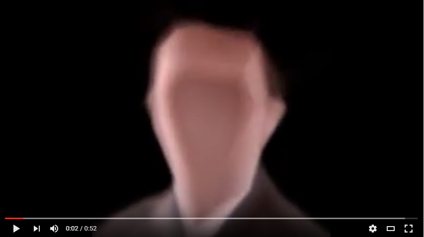
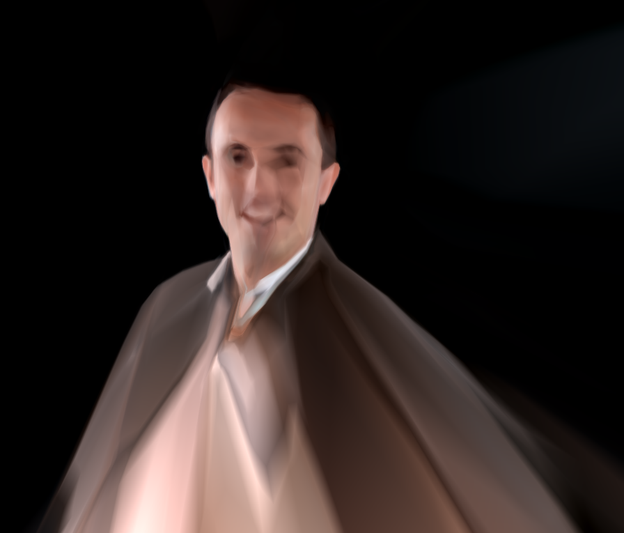

### Facepaint
This is toy regression problem ("image regression", essentially a port of [Karpathy's excellent ConvNetJS demo](http://cs.stanford.edu/people/karpathy/convnetjs/demo/image_regression.html)), written in Keras.  To run it, you'll need to have Python, Keras, and either TensorFlow or Theano (which Keras uses to do the actual computations).

What does it do?  You feed it a photo as *test data*; it then tries to learn to predict the (r,g,b) for a given (x,y).  For example, an image 256 pixels by 256 pixels yields 65,536 training examples.  We can see what the model has learned by asking it to give an (r,g,b) for each (x,y) in the original image.  Below, a video shows how the output changes as the model converges.

What's the point? Mostly, educating the programmer!  Because the output is so visual (it writes out one JPG per training iteration to show what it has learned so far), it really makes it easy to see the effect of changing the model (more/fewer layers, wider/narrower layers) or of tweaking meta-paramters or optimizers.  

Not done, but could be interesting: mask out areas of the image during training, then ask the model to make predicitions to fill in those missing areas.

The renderer script will load pre-trained model weights and use them to render a new image at whatever resolution you like; it can also scale and translate, and even render areas outside the original image, as in the above picture, where the model has "imagined" me to be wearing a cape.  Since the model you trained doesn't have any pixels internally, it is resolution-independent - you can think of it as vector artwork - and also infinite in extent!

I learned a lot in writing and playing with this - hopefully, you will too.
