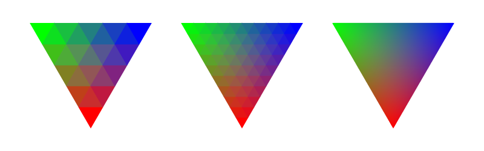
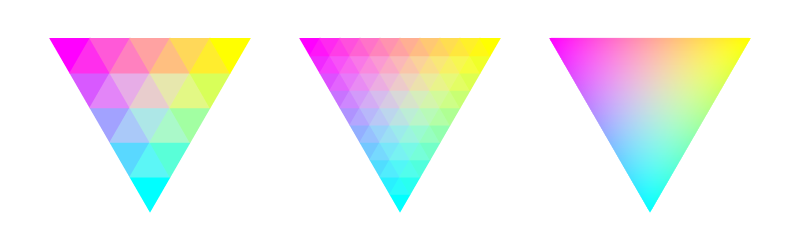

# python-svg-color-triangle

Need to interpolate between three colors in the shape of a variable density equilateral triangle for a map legend? Look no further! See below for example output:

<fig></fig>

<fig></fig>

<fig></fig>

